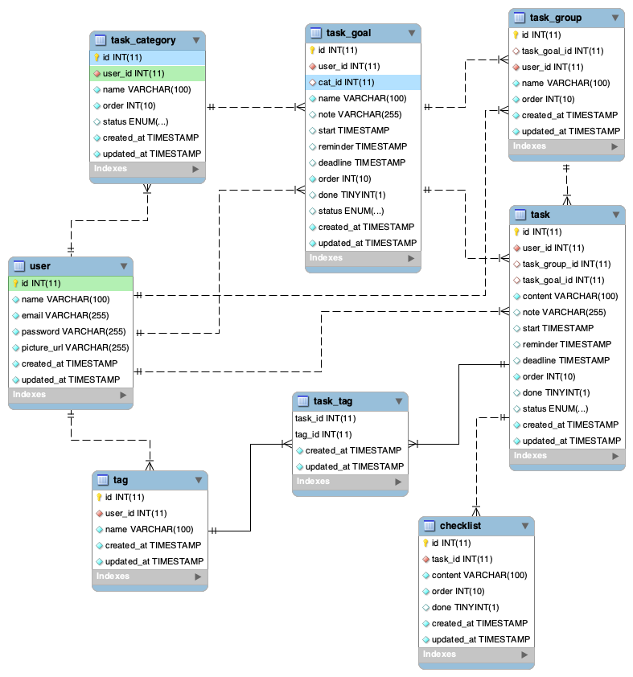

# WeNote Entity Relationship Diagram
Refer to [schema.sql](./schema.sql)

#### Notes:
- Task group can be treated as a normal task, share the same order with task.
- Task goal can either belongs into specific task category or stay alone.